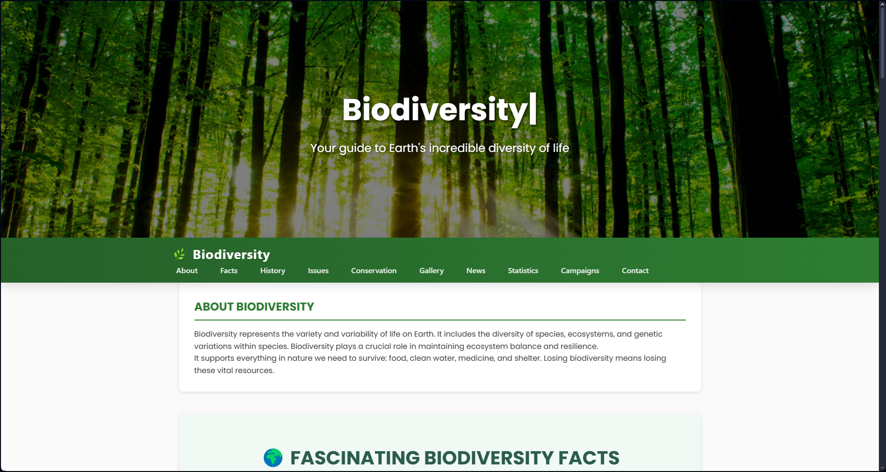

# BioDiversity

**BioDiversity** is a web-based platform designed to raise awareness about global biodiversity through interactive maps, informative content, and rich visuals. It integrates geospatial data with educational narratives to highlight critical biodiversity hotspots and global conservation efforts.

---

## 📸 Project Snapshot




---

## 🔍 Overview

The project focuses on delivering a visually engaging and informative experience to users who wish to explore:

- Biodiversity hotspots across different continents
- Protected areas and environmental reserves
- Conservation challenges and global efforts
- Stunning visuals representing Earth's diverse ecosystems

---

## 🎯 Key Features

- 🗺️ **Interactive Mapping Interface**: Built using Leaflet.js and OpenStreetMap to dynamically visualize biodiversity regions.
- 📚 **Educational Content**: Clear explanations and insights into the importance of conservation.
- 🌿 **Media Integration**: High-quality images to immerse users in the beauty of biodiversity.
- 💡 **Responsive Design**: Optimized layout across desktops, tablets, and mobile devices.
- ⚡ **Lightweight Architecture**: Minimal dependencies, fast load times, and clean structure.

---

## 🧰 Technology Stack

| Layer          | Tools & Frameworks         |
|----------------|-----------------------------|
| Frontend       | HTML5, CSS3, JavaScript     |
| Mapping API    | [Leaflet.js](https://leafletjs.com/) |
| Map Tiles      | [OpenStreetMap](https://www.openstreetmap.org/) |
| Server         | Node.js                     |
| Media Assets   | Custom and Open-licensed images |

---

## 🚀 Getting Started

To run this project locally:

1. **Clone the Repository**
   ```bash
   git clone https://github.com/Bookinheaven/BioDiversity.git
   cd BioDiversity
   ```
2. **Install the required packages**
   ```bash
   npm install
   ```
3. **Open the Webpage**
   - Open run `npm run server.js`

4. **Ensure the following:**
   - Internet access for Leaflet and map tiles.
   - No typos or missing files.

---
Thank you for exploring biodiversity with us! 🌍💚

